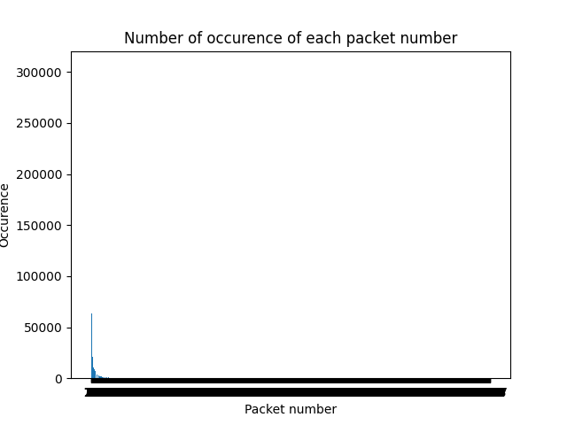
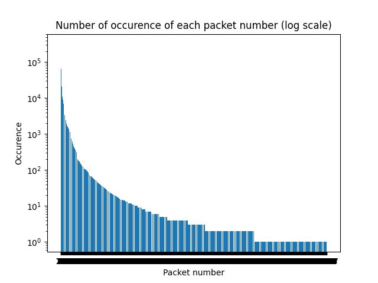
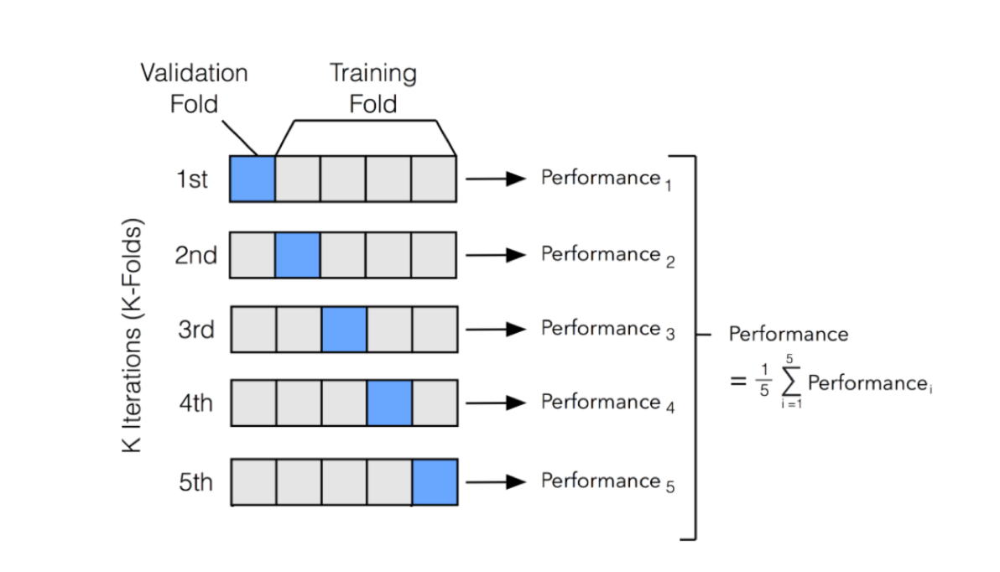
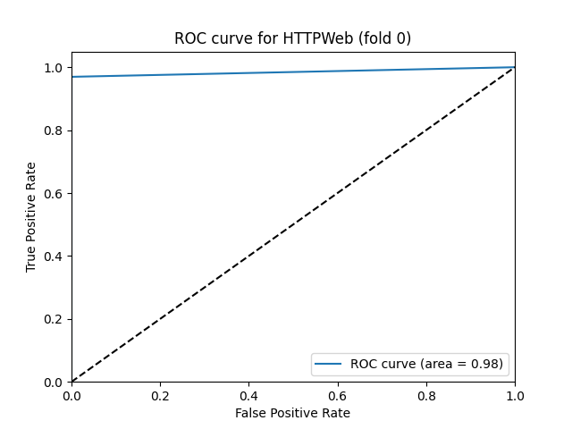
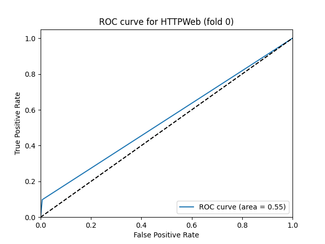
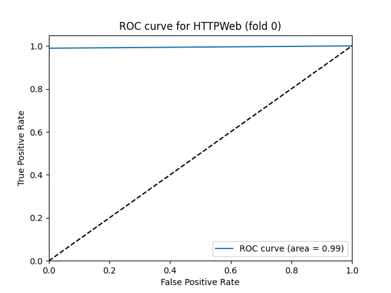
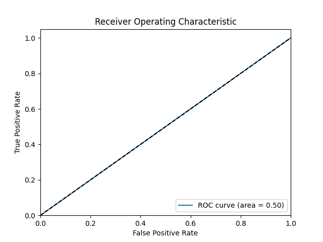

# Summary

---

<!-- TOC -->

* [Summary](#summary)
* [Abstract](#abstract)
    * [Data Processing:](#data-processing)
    * [AI Models and Attack Detection:](#ai-models-and-attack-detection)
* [Introduction](#introduction)
* [Project structure](#project-structure)
    * [Subproject 1: Data processing](#subproject-1-data-processing)
        * [Load data](#load-data)
        * [Design an API](#design-an-api)
        * [Data visualization](#data-visualization)
    * [Subproject 2: IA models and attack detection](#subproject-2-ia-models-and-attack-detection)
        * [Preparing the classification tasks](#preparing-the-classification-tasks)
        * [Classification Models](#classification-models)
* [Model evaluation and comparison](#model-evaluation-and-comparison)
    * [KNN](#knn)
    * [Naive Bayes](#naive-bayes)
    * [Random Forest](#random-forest)
    * [MLP](#mlp)
    * [Global](#global)
        * [Conclusion](#conclusion)
* [Appendix 1: User's Manual](#appendix-1-users-manual)
* [Appendix 2: Licensed code](#appendix-2-licensed-code)

<!-- TOC -->

---

# Abstract

This project aims to deepen the understanding of AI-based attack detection.
It is primarily divided into two distinct parts:

## Data Processing:

This first part highlights the importance of a quality dataset and explains how to process it effectively.
The use of ElasticSearch for data storage and processing is detailed, along with exploration of ElasticSearch queries to
extract the necessary data.

## AI Models and Attack Detection:

The second part focuses on training and using artificial intelligence models to detect attacks.
Different models, such as K-Nearest Neighbors, Naive Bayes, Random Forest, and Multi-layer Perceptron, are presented.
The importance of model selection and data preparation is discussed in detail.

The project concludes with a comparative evaluation of the models, emphasizing the effectiveness of the Random Forest
model for attack detection.
This in-depth understanding of data processing and the use of AI models provides valuable insights for the project's
future phases.

# Introduction

This project as in main objectif the comprehension of how IA detection works, in case of attack detection.
More precisely, the project has been split in two parts :

1. How the source data is stored and processed
2. How IA models are trained and used to detect attacks with the processed data

The first part about data processing presents how important it is to have a good data set, and how to process it to
be able to use it in the second part.
As challenges showed up, the data processing can be a huge part of the project, and always impact how good the IA models
will be.
Subproject 1 lets us learn about ElasticSearch and how to use it to store and process data.
It also lets us learn about the requests we can do on ElasticSearch, and how to use them to get the data we want.

The second part about the IA models presents how to train and use them to detect attacks.
By proposing several models, we will see how important is the choice of the model, and how to use it to get the best
results.

# Project structure

Our project is split in two subprojects, each one having its own directory.
The first one is about the data processing, and the second one is about the IA models and attack detection.

Each subproject can be used independently.

## Subproject 1: Data processing

This subproject is plotted in multiple files, each one having its own purpose and corresponding to a step of the
project.

### Load data

The first step that we have to do is to load the data into our ElasticSearch database.
To do so, we have to use the file `import_data.py`.
For a more practical use, we have chosen to place our ElasticSearch database on a private server.
This alloys us to only have one database for both of us.
It also allowed us to avoid some problems with the RAM, as we don't have to load the database on our own computer.

In the file, we start by defining the ElasticSearch object, with providing some information about the database.

```python
es = Elasticsearch("https://tdelastic:9200", verify_certs=False, request_timeout=1000000,
                   basic_auth=(LOGIN, PASSWORD))
```

> _Note:_ Login and password are provided in `.env` file, that is not pushed on the repository (for security reasons
> obviously).

After that, we are able to discuss with the database.

To talk a bit about the data them self, we use multiple `.xml` file that have been generated (from the packet files
pcap) using IBM QRadar appliance.
These files are composed of multiple flows, each one corresponding to a network connection.
These flows are related to different protocols, and have different attributes.
To give an example, a flow looks like this :

```xml

<TestbedMonJun14Flows>
    <appName>Unknown_UDP</appName>
    <totalSourceBytes>16076</totalSourceBytes>
    <totalDestinationBytes>0</totalDestinationBytes>
    <totalDestinationPackets>0</totalDestinationPackets>
    <totalSourcePackets>178</totalSourcePackets>
    <sourcePayloadAsBase64></sourcePayloadAsBase64>
    <destinationPayloadAsBase64></destinationPayloadAsBase64>
    <destinationPayloadAsUTF></destinationPayloadAsUTF>
    <direction>L2R</direction>
    <sourceTCPFlagsDescription>N/A</sourceTCPFlagsDescription>
    <destinationTCPFlagsDescription>N/A</destinationTCPFlagsDescription>
    <source>192.168.5.122</source>
    <protocolName>udp_ip</protocolName>
    <sourcePort>5353</sourcePort>
    <destination>224.0.0.251</destination>
    <destinationPort>5353</destinationPort>
    <startDateTime>2010-06-13T23:57:19</startDateTime>
    <stopDateTime>2010-06-14T00:11:23</stopDateTime>
    <Tag>Normal</Tag>
</TestbedMonJun14Flows>
```

One of the most important attributes is the `Tag` one.
It is used to know if the flow is an attack or not.
If it is an attack, the value will be `Attack`, otherwise it will be `Normal`.

So our second step is to load the data into the database.
To do so, we have parsed one by one each `.xml` file, and inserted the flows into the database.
To do so, we have used the `bulk` function of ElasticSearch.
This function allows us to insert multiple data at once, and is way faster than inserting one by one the data.

```python
success, failed = bulk(es, dictionnaries, index="ia-detection-intrusion")
```

To clarify, we have stored the data in the `ia-detection-intrusion` index.
So all the data are stored in the same index.
This is not a problem, as we can use filters to get the data we want.

### Design an API

One of the parts of the project is to design an API to get the data we want from the ElasticSearch database.

To do so, we have chosen to place all the API functions into the `functions.py` file.
This file contains, also like the `import_data.py` file, an ElasticSearch object, to be able to discuss with the
database, and more precisely with the `ia-detection-intrusion` index.

All the functions are using the `search` function of ElasticSearch.
This function allows us to get the data we want using filters.
For example, if we want to get all the data that have the `Tag` attribute equal to `Attack`, we can use the following
filter :

```python
body = {
    "query": {
        "match": {
            "Tag": "Attack"
        }
    }
}
```

This filter will be used in the `search` function, and will return all the data that have the `Tag` attribute equal to
`Attack`.

One of the biggest challenges of this part was to find the right filters to get the data we want and this without the
limitation of size of the data.
Indeed, ElasticSearch has a limitation of 10 000 data returned by request.
To avoid this limitation, we have used the `scroll` function of ElasticSearch.
This function allows us to get all the data we want, without any limitation.

### Data visualization

In the subject, we have been asked to visualize the data we have in the database.
We have stored the code into the `flows_packets_draw.py` files.

To do that, we have request our database with the following filter :

```python
query = {
    "size": 0,
    "aggs": {
        "packet_number": {
            "terms": {
                "script": {
                    "source": "doc['totalDestinationPackets'].value + doc['totalSourcePackets'].value",
                    "lang": "painless"
                },
                "size": 10000
            }
        }
    }
}
```

This filter will return all the data we have in the database, but only the `totalDestinationPackets` and
`totalSourcePackets` attributes.
These attributes are the number of packets that have been sent and received by the
source and the destination of the flow.
We have chosen to sum these two attributes to get the total number of packets that have been sent and received by the
source and the destination of the flow.

After this, we had simply to plot the data we have got.




As you can see, the first plot is not really readable because of the huge number of flows that have a low number of
packets.
To avoid this, we have plotted the same data, but with a logarithmic scale.
This plot is way more readable, and we can see that the majority of the flows have a low number of packets.

To interpret this, it is important to know that the flows are related to different protocols.
Some protocols are sending a lot of packets, and some others are sending only a few packets.
This is why we have a lot of flows with a low number of packets. But the huge spike at the beginning of the plot is not
normal.
Indeed, we can see that we have a lot of flows with only one packet.
This is not normal, and is probably due to a problem with the data.

## Subproject 2: IA models and attack detection

As announced in the introduction, this subproject is about the IA models and attack detection. All the file related to
this subproject are in the `sub-project-2` directory.

### Preparing the classification tasks

The first task that we have to do is to prepare the data for the classification tasks. To do so, we have used two
different
files.

**The first one** is the `import_data.py` file, that we have already used in the first subproject.
But we still made some changes to it.
To gain some time, we have chosen to directly used `.xml` files instead of using our ElasticSearch database.
So now, this file only provides us the function `get_dictionnaries()` that returns the content of the `.xml`.

**The second file** is the `split_data.py` file. This file provides us multiple functions :

- `split_data()` that split the data into 4 `appName` categories (HTTPWeb, SSH, SMTP and FTP).
  This function also splits each category into five parts (talked about this later).
- `serialize()` that serialize the data into a `dictionnariesByAppNameSplitted.pickle` file.
  This file is used to load the data more quickly and prevent us from having to load and split the data each time we
  want to use them.
- `process_datas()` that process the data to be able to use them in the models.
  This function is used to transform the data into a numerical format.
  **This is the most important part of the task.**
- `get_pickle_file()`that returns the content of the `dictionnariesByAppNameSplitted.pickle` file.

To speak a bit more about the `split_data()` function, we are splitting the data into five parts to be able to use the
cross-validation method.
This method is used to train and test our models.
To do so, we are using four parts to train the models, and the last one to test them.
We are doing this five times, and each time we are using a different part to test the models.
This allows us to have a better idea of how good our models are.



Speaking about the `process_datas()` function, we are using multiple transformations functions that we have created.

- `transform_IP()` : This function is simply transforming the IP address into a number.
  More precisely, we transform it into a 32-bit integer.
- `transform_date()` : This function is transforming the date into a number.
  More precisely, we transform it into the number of seconds since the 1st of January 1970 (Unix time).
- `transform_protocolName()` : This function is transforming the protocol name into a number.
  The number is chosen based on the index of the protocol name in the list of all the protocol names.
  (tcp_ip, udp_ip, icmp_ip, igmp, ip, ipv6igmp)
- `transform_payload()` : This function was pretty challenging to create.
  The idea is to transform the payload into a number.
  In first, we have chosen to decode the payload using the `base64` encoding.
  But we have quickly seen that this was not a good idea, as the result is a too long integer.
  So we have chosen to apply a hash function to the decoded payload.
  This allows us to have a shorter integer (working for KNN), but it is still not working for other models (Random
  Forest).
  We don't have found a better solution to this problem.
  To avoid this problem, we have chosen to not use this column in the models.
- `transform_direction()` : This function is transforming the direction into a number based on the index of the
  direction in the list of all the directions (L2R, R2L, L2L, R2R).
- `transform_TCPFlagsDescription()` : Works like the `transform_protocolName()` function.
  Integers are chosen based on a list ("N/A", "F,S,P,A", "F,A", "R", "F,P,A", "S, P, A", "S,A", "P,A", "A", "S", "R,A").
- `transform_tag()` : Pretty simple function, 1 if the tag is "Attack", 0 if "Normal".

All these functions are crucial because we need to transform the data into a numerical format to be able to use
them in the models.
On a previous version of the project, we have tried to use the data without transforming them, and it was badly working.
All the models were returning a good accuracy, but the ROC indicator was terrible (~0.5, equivalent to a random
choice).

### Classification Models

In this second task, we have to train and test different classification models. More precisely, four models :

- K-Nearest Neighbors classifier
- Naive Bayes classifier
- Random Forest classifier
- Multi-layer Perceptron classifier

To do so, we have chosen to use a file for each model.
Each file contains the code to train and test the model.
The results are then printed in the console.

For each model, we globally have the same code.
We start by loading the data using the `get_pickle_file()` function from the `split_data.py` file.
After that, we are making a loop to train and test on each `appName` category.
And for each category, we are making a loop to train and test on each part of the data.

For each part, we are selecting the data we want to use to train and test the model.
Training data are pop() from the data, and testing data are the remaining data.
After that, we are applying some transformations to the data.
For example, we are using the `LabelEncoder()` function to transform all non `int` attribute into a number.
This is necessary to be able to use the data in the models.
Next, we are using the `SimpleImputer()` function to replace all `NaN` values by the mean of the column.
This is also necessary to be able to use the data in the models.
Finally, we are creating the model, and training it with the training data (with the function `fit()` of the model).

The model is now trained, and we can use it to predict the testing data.
To do so, we are using the `predict()` function of the model.
This function returns a list of predictions.
We are then comparing these predictions with the real values of the testing data, and calculating the accuracy of the
model.

Because we are using the cross-validation method, we are doing this five times per appName category.
And after that, we make the means of the accuracy of the five tests.
This allows us to have a better idea of how good our models are.

# Model evaluation and comparison

Now that we have trained and tested our models, we have to evaluate and compare them.

#### KNN

KNN is probably the most simple classification model.
It is based on the distance between the data.
The idea is to find the K nearest neighbors of the data, and to classify the data based on the neighbors.

And as you can see in the results, this model is pretty good.
The accuracy is around `99%` for all the categories.
But the best is the ROC indicator.
For all the categories, the ROC is around `0.9`.

Here is an example of the ROC curve for the _HTTPWeb_ category :



```plaintext
Results :
[+] HTTPWeb
 ╰─ Mean Accuracy: 99.83410889052463
 ╰─ Median Accuracy : 99.83191588486238
 ╰─ Mean Precision : 0.9323719879324288
 ╰─ Mean ROC AUC : 0.922938276369142
[+] SSH
 ╰─ Mean Accuracy: 99.98968540484786
 ╰─ Median Accuracy : 100.0
 ╰─ Mean Precision : 0.9998087954110899
 ╰─ Mean ROC AUC : 0.9999294283697953
[+] SMTP
 ╰─ Mean Accuracy: 99.91680147019953
 ╰─ Median Accuracy : 99.93069993069993
 ╰─ Mean Precision : 0.9854343185616259
 ╰─ Mean ROC AUC : 0.9695434652892482
[+] FTP
 ╰─ Mean Accuracy: 99.77809144660078
 ╰─ Median Accuracy : 99.82935153583618
 ╰─ Mean Precision : 0.9692681411015588
 ╰─ Mean ROC AUC : 0.9723742178026145
```

#### Naive Bayes

Naive Bayes is a classification model based on the Bayes theorem.
The idea is to calculate the probability of each category, and to classify the data based on the probability of each
category.

As you can see in the results, this model is **depending on the category**.
For the majority of the categories, the ROC indicator is around `0.5`.
This is equivalent to a random choice and that sucks.
Only _FTP_ is working well with this model with a ROC indicator around `0.9`.

Here is an example of the ROC curve for the _HTTPWeb_ category :



```plaintext
Results :
[+] HTTPWeb
 ╰─ Mean Accuracy: 98.39389110563346
 ╰─ Median Accuracy : 98.67907809516849
 ╰─ Mean Precision : 0.5404557374966396
 ╰─ Mean ROC AUC : 0.5533703016315652
[+] SSH
 ╰─ Mean Accuracy: 75.16756432000766
 ╰─ Median Accuracy : 75.0
 ╰─ Mean Precision : 0.8736756701734437
 ╰─ Mean ROC AUC : 0.5322518895493253
[+] SMTP
 ╰─ Mean Accuracy: 97.69866099963187
 ╰─ Median Accuracy : 97.57449757449757
 ╰─ Mean Precision : 0.656003301540719
 ╰─ Mean ROC AUC : 0.9807490057894134
[+] FTP
 ╰─ Mean Accuracy: 85.35459265053554
 ╰─ Median Accuracy : 85.31796841655996
 ╰─ Mean Precision : 0.5586705979412233
 ╰─ Mean ROC AUC : 0.9253365791167967
```

#### Random Forest

Random Forest is a classification model based on decision trees.
The idea is to create multiple decision trees, and to use them to classify the data.
The final classification is based on the classification of each tree.

As you can see in the results, this model is pretty good.
The accuracy is around `99%` for all the categories and `0.99` for the ROC indicator.
This is the best model we have.

Here is an example of the ROC curve for the _HTTPWeb_ category :



```plaintext
Results :
[+] HTTPWeb
 ╰─ Mean Accuracy: 99.99744221326846
 ╰─ Median Accuracy : 99.9981729987485
 ╰─ Mean Precision : 0.9995135659942382
 ╰─ Mean ROC AUC : 0.9982904236198072
[+] SSH
 ╰─ Mean Accuracy: 99.98968540484786
 ╰─ Median Accuracy : 100.0
 ╰─ Mean Precision : 0.9999301675977653
 ╰─ Mean ROC AUC : 0.9998031496062992
[+] SMTP
 ╰─ Mean Accuracy: 99.97226074895977
 ╰─ Median Accuracy : 100.0
 ╰─ Mean Precision : 0.9998598452109688
 ╰─ Mean ROC AUC : 0.9870445344129555
[+] FTP
 ╰─ Mean Accuracy: 100.0
 ╰─ Median Accuracy : 100.0
 ╰─ Mean Precision : 1.0
 ╰─ Mean ROC AUC : 1.0
```

#### MLP

The MLP model is a neural network model.
It is based on multiple layers of neurons.
Each neuron is connected to the neurons of the previous layer.
The idea is to train the model to be able to classify the data.

As you can see in the results, this model is pretty terrible.
For the majority of the categories, the ROC indicator is around `0.5` (equivalent to a random choice).
Only _SSH_ is working well with this model with a ROC indicator around `0.85`.



```plaintext
Results :
[+] HTTPWeb
 ╰─ Mean Accuracy: 99.41664066669647
 ╰─ Median Accuracy : 99.41262446332328
 ╰─ Mean Precision : 0.4970832033334823
 ╰─ Mean ROC AUC : 0.5
[+] SSH
 ╰─ Mean Accuracy: 92.39975968056656
 ╰─ Median Accuracy : 92.37113402061856
 ╰─ Mean Precision : 0.9496766445957265
 ╰─ Mean ROC AUC : 0.8588010369325156
[+] SMTP
 ╰─ Mean Accuracy: 98.96019138737587
 ╰─ Median Accuracy : 98.8911988911989
 ╰─ Mean Precision : 0.4948009569368793
 ╰─ Mean ROC AUC : 0.5
[+] FTP
 ╰─ Mean Accuracy: 98.1394728907107
 ╰─ Median Accuracy : 98.12286689419795
 ╰─ Mean Precision : 0.6722472823958696
 ╰─ Mean ROC AUC : 0.5427075049301581
```

#### Global

In global, the Random Forest model is the best one.
It is the only one that is working well for all the categories.
The KNN model is also pretty good, but it is not working well for the _SMTP_ category.
The Naive Bayes model is working well only for the _FTP_ category.
And the MLP model is working well only for the _SSH_ category.


## Conclusion

The project was divided into two main parts: data processing and the use of AI models for attack detection.

In the first part, emphasis was placed on the importance of a good data set and how to process it for use in the second
part.
We used ElasticSearch to store and process the data, and we learned how to make requests on ElasticSearch to get the
desired data.
We also designed an API to extract data from the ElasticSearch database.

In the second part, we presented how to train and use AI models to detect attacks.
We proposed several models and discussed the importance of choosing the model and how to use it to get the best results.
We were then able to prepare the data for classification tasks using different transformation functions to convert the
data into a numerical format.
Then, we trained and tested different classification models: K-Nearest Neighbors, Naive Bayes, Random Forest, and
Multi-layer Perceptron.

Finally, we evaluated and compared the performance of these models.
The Random Forest model proved to be the best, performing well for all categories.
The KNN model also gave good results, except for the SMTP category.
The Naive Bayes model only worked well for the FTP category, and the MLP model only worked well for the SSH category.

In conclusion, this project allowed us to gain a deep understanding of data processing and the use of AI models for
attack detection.
It also highlighted the importance of choosing the right model and properly preparing the data to get the best results.

This knowledge base will be beneficial for the continuation of the project and the realization of the "Challenges".

# Appendix 1: User's Manual

For more information about the project, please refer to all README.md files next to the files you want to use.

# Appendix 2: Licensed code

No licensed code has been used in this project. All the code has been written by us.