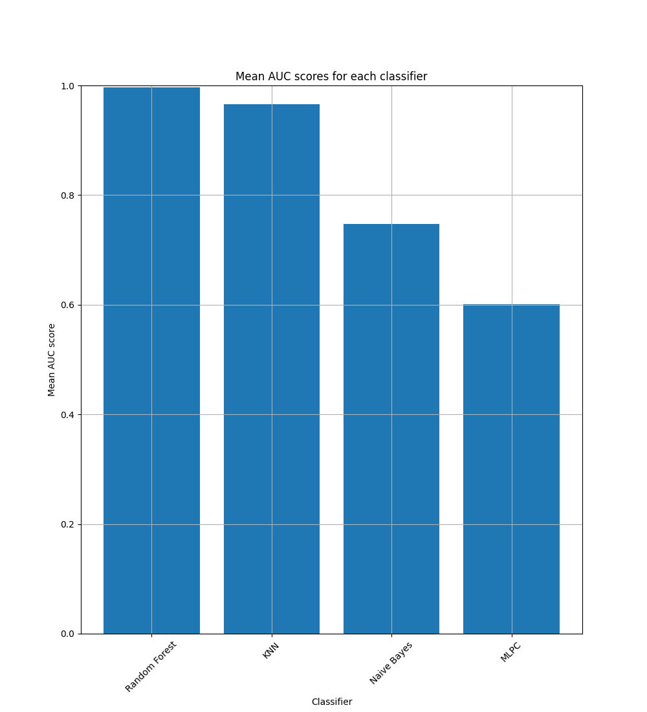

# Sub-project 2

## Installation

Clone project:

```
git clone git@github.com:Enailis/IA-Detection-Intrusion.git
```

Install dependencies:

```
cd IA-Detection-Intrusion/sub-project-2
pip install -r requirements.txt
```

Create a folder called `TRAIN_ENSIBS` and put every `.xml` files required for the training.

You can now execute every python while by using the command `python3 <file.py>`.

## Disclamer

This projet is suppose to get the datas pushed to ELK in [sub-project-1](../sub-project-1/README.md) but to gain some
time *(because of the horrible bandwidth of our school)* we decided to serialize the datas in a pickle file.

## First data loading

You can use the file `split_data.py` to load the data from the `.xml` files and split them depending on appName.
For each appName category, the data is split into 5 sub dictionaries.

The data is then saved on `dictionnariesByAppNameSplitted.pickle`to avoid having to load the data every time.
So you only need to create the pickle file once.

This file will be used in following function to load the data.

## Models training

### KNN

You can use the file `knn.py` to train the KNN model on the data.
The model is train on one of the 5 sub dictionaries of the data. The 4 others are used to test the model.

The model is using 3 neighbors. That means that the model will look at the 3 closest neighbors to determine the
category of the data.

### Naive Bayes

You can use the file `NaiveBayes.py` to train the Naive Bayes model on the data.
The model is train on one of the 5 sub dictionaries of the data. The 4 others are used to test the model.

### Random Forest

You can use the file `RandomForest.py` to train the Random Forest model on the data.
The model is train on one of the 5 sub dictionaries of the data. The 4 others are used to test the model.

The model is using 100 trees.

### Multilayer Perceptron classification

You can use the file `MultilayerPerceptron.py` to train the Multilayer Perceptron classification model on the data.
The model is train on one of the 5 sub dictionaries of the data. The 4 others are used to test the model.

## Data processing

### KNN

```plaintext
Accuracy scores :
[+] HTTPWeb
 ╰─ Mean : 98.93600399415638
 ╰─ Median : 98.9570130424754
 ╰─ Mean Precision : 0.497512398499892
 ╰─ Mean ROC AUC : 0.497932444876514
[+] SSH
 ╰─ Mean : 64.09715573286715
 ╰─ Median : 64.62549954879464
 ╰─ Mean Precision : 0.5722680190618965
 ╰─ Mean ROC AUC : 0.5829875879836963
[+] SMTP
 ╰─ Mean : 98.86316420445621
 ╰─ Median : 98.83902269970542
 ╰─ Mean Precision : 0.494796009010065
 ╰─ Mean ROC AUC : 0.4995096749777563
[+] FTP
 ╰─ Mean : 97.13023992874685
 ╰─ Median : 97.11938546890003
 ╰─ Mean Precision : 0.579660677009638
 ╰─ Mean ROC AUC : 0.6693818115293796
```

### Naive Bayes

```plaintext
Results :
[+] HTTPWeb
 ╰─ Mean Accuracy: 99.41664063165945
 ╰─ Median Accuracy : 99.416047392196
 ╰─ Mean Precision : 0.49708320315829724
 ╰─ Mean ROC AUC : 0.5
[+] SSH
 ╰─ Mean Accuracy: 26.544304651042758
 ╰─ Median Accuracy : 26.4535258476215
 ╰─ Mean Precision : 0.13272152325521383
 ╰─ Mean ROC AUC : 0.5
[+] SMTP
 ╰─ Mean Accuracy: 98.96021072313098
 ╰─ Median Accuracy : 98.9428076256499
 ╰─ Mean Precision : 0.49480105361565496
 ╰─ Mean ROC AUC : 0.5
[+] FTP
 ╰─ Mean Accuracy: 98.07117853302196
 ╰─ Median Accuracy : 98.06892136989225
 ╰─ Mean Precision : 0.4903558926651098
 ╰─ Mean ROC AUC : 0.5
```

### Random Forest

```plaintext
Results :
[+] HTTPWeb
 ╰─ Mean Accuracy: 99.3865865862443
 ╰─ Median Accuracy : 99.40211520586831
 ╰─ Mean Precision : 0.49982340311876444
 ╰─ Mean ROC AUC : 0.5000794844564099
[+] SSH
 ╰─ Mean Accuracy: 98.46333541413235
 ╰─ Median Accuracy : 99.81954111884507
 ╰─ Mean Precision : 0.989730836268744
 ╰─ Mean ROC AUC : 0.9722444199826665
[+] SMTP
 ╰─ Mean Accuracy: 99.67073760003026
 ╰─ Median Accuracy : 99.63604852686309
 ╰─ Mean Precision : 0.9873358805098771
 ╰─ Mean ROC AUC : 0.8554693348473735
[+] FTP
 ╰─ Mean Accuracy: 99.89331990568627
 ╰─ Median Accuracy : 99.91465756347344
 ╰─ Mean Precision : 0.9895174575111664
 ╰─ Mean ROC AUC : 0.9820131190167954
```

### Multilayer Perceptron classification

```plaintext
Results :
[+] HTTPWeb
 ╰─ Mean Accuracy: 99.4155901107381
 ╰─ Median Accuracy : 99.416047392196
 ╰─ Mean Precision : 0.49708317296381316
 ╰─ Mean ROC AUC : 0.4999947170279377
[+] SSH
 ╰─ Mean Accuracy: 94.11406135243028
 ╰─ Median Accuracy : 96.0041247744264
 ╰─ Mean Precision : 0.9456602456887089
 ╰─ Mean ROC AUC : 0.9065492485365457
[+] SMTP
 ╰─ Mean Accuracy: 95.03301483212392
 ╰─ Median Accuracy : 97.157712305026
 ╰─ Mean Precision : 0.5654041466829387
 ╰─ Mean ROC AUC : 0.612705936370572
[+] FTP
 ╰─ Mean Accuracy: 98.22906135771093
 ╰─ Median Accuracy : 98.14360396884668
 ╰─ Mean Precision : 0.7148723512698955
 ╰─ Mean ROC AUC : 0.6099666125328862
```

## Model comparison

Overall, the results seem diverse. The performances are higher for Random Forest models, indicating a good
generalization on the test data. Naive Bayes models appear to be less effective. However, it's important to consider
other aspects such as class imbalance, sample size, and possibly adjust hyperparameters to enhance performance



**Conclusion**:

- Random Forest appears to be the most stable and effective choice among the tested models, with high performance across
most categories.
- Naive Bayes seems less effective in this configuration.
- KNN exhibits variable performance across
categories.
- Multilayer Perceptron shows competitive performance but with some variability
