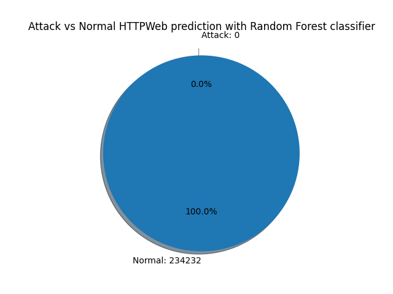
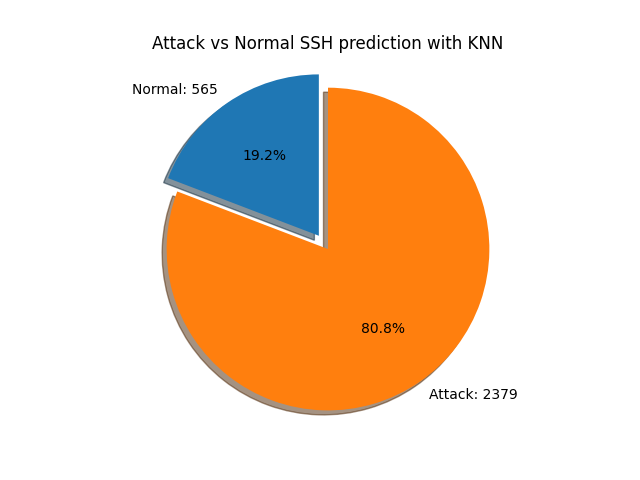
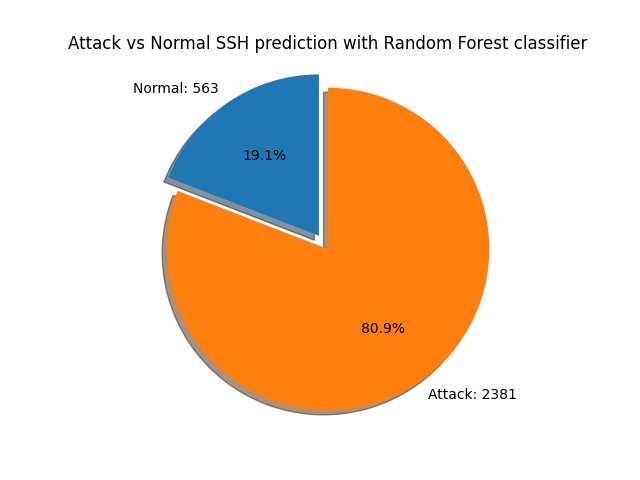

# Challenge 1

## Description

The goal of this challenge is to determine the number of flows that can be considered as a flow "_Attack_".
To do this, we have to use our previous work from [sub-project-1](../../sub-project-1/README.md)
and [sub-project-2](../../sub-project-2/README.md).

In our case, we will use the Random Forest and K-Nearest Neighbors classifiers to determine the number of "_Attack_"
flows.

## How to run

We have chosen to use a file for each classifier and each protocol.
These files are getting the corresponding data, train the classifier and then test it.
A pie chart and a result file are generated for each classifier and each protocol.

Pie charts are generated in the `plot_images` folder.

Result files are generated in the `results` folder.

To start, you can create all pickle files by running the files `split_datas.py`.
It will create the pickle files :

- `test_httpweb.pickle`
- `test_ssh.pickle`
- `train.pickle`

**Warning** : `split_datas.py` supposed that you have place all training `.xml` into the `TRAIN_ENSIBS` folder and all
testing `.xml` into the `challenge1_data` folder.

After that, you can run the following files to generate the pie charts and the result.

- `challenge1_httpweb_KNN.py`
- `challenge1_httpweb_RF.py`
- `challenge1_ssh_KNN.py`
- `challenge1_ssh_RF.py`

## Some result examples

### HttpWeb

From our `HttpWeb` results, we can see that we have a very few "_Attack_" flows.
Only 12 flows for the KNN classifier and 0 for the Random Forest classifier.

### SSH

From our `SSH` results, this is much more interesting.
We have 2379 "_Attack_" flows for the KNN classifier and 2381 for the Random Forest classifier.
That seems to be a lot of "_Attack_" flows but still possible.

